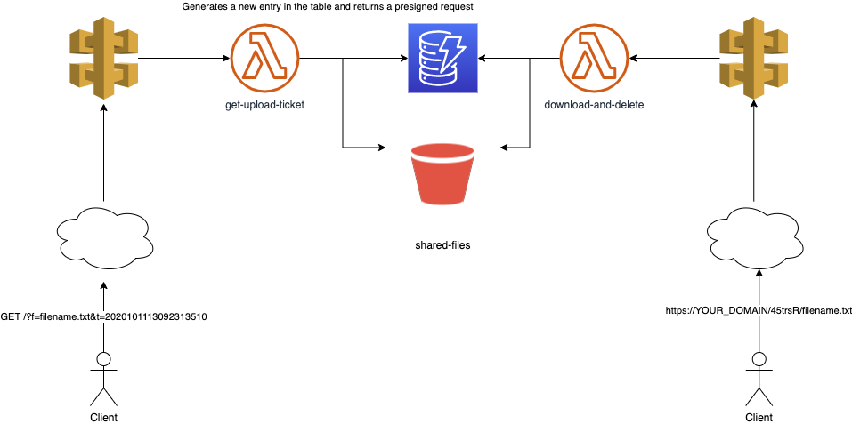

# once: a one-time file sharing personal service

*once* is a personal cloud service that enables you to upload a local file of any size and get a link in return.

This link will allow *one single* download operation, deleting the file once it has been successfully transferred.

*once* is designed to run on AWS using only *serverless* components.

It can be easily provisioned to a private AWS account and it has been designed to have a negligible footprint on the bill.

## Deploying on AWS

*once* is implemented using the [AWS CloudDevelopment Kit](https://docs.aws.amazon.com/cdk/) framework, and can be easily deployed as a self-contained CloudFormation stack to any AWS account.

Make sure you have installed the latest CDK version for your platform, following the steps described in the [official getting started guide](https://docs.aws.amazon.com/cdk/latest/guide/getting_started.html).

Install the required dependencies (you can use a virtualenv for this), with the following command:

    pip install -r requirements.txt

The deployment can be then initiated, from the project root directory, with the following command:

    $ cdk deploy

The output will include the base URL to use the service API.

    ...
    ✅  once

    Outputs:
    once.baseurl = https://xxxxxxxxxx.execute-api.eu-west-1.amazonaws.com/

Update your configuration file (by default it can be found at `~/.once`) adding the URL
under the `base_url` option, like in the following example config file:

    [once]
    secret_key = RBeXidk41E1lmB5x839sVjo.....
    base_url = https://rrjvo2i9s5.execute-api.eu-west-1.amazonaws.com/

### Using a custom domain (optional)

If you want to expose the once API on a custom domain name hosted on 
[Route 53](https://aws.amazon.com/route53/), you can just set the following environment variables before the deployment:

- `CUSTOM_DOMAIN` the domain name you want to expose the once API (e.g. _once.mydomain.com_)
- `HOSTED_ZONE_NAME` the Route 53 hosted zone name (e.g. _mydomain.com_)
- `HOSTED_ZONE_ID` the Route 53 hosted zone ID (e.g. _Z0113243DF12WNGOIXX_)

then the deployment command would look like the following example:

    $ DOMAIN_NAME=once.mydomain.com \
      HOSTED_ZONE_NAME=mydomain.com \
      HOSTED_ZONE_ID=Z0113243DF12WNGOIXX \
      cdk deploy

If you need more details about creating a public hosted zone on AWS, consult the [official documentation](https://docs.aws.amazon.com/Route53/latest/DeveloperGuide/CreatingHostedZone.html).

## Uploading a file

To make the `once` command available you can install it using pip, with the following command:

    $ pip install .

Once the service and the client have been correctly installed and configured, you can upload a local file running the `once` command.

    once <file_toshare>

The URL can be shared to download the file, only once.

## Uninstalling

If you want to completely remove *once* from your AWS account, you will need to run the following command:

    cdk destroy

then remember to delete your config file:

    rm ~/.once
